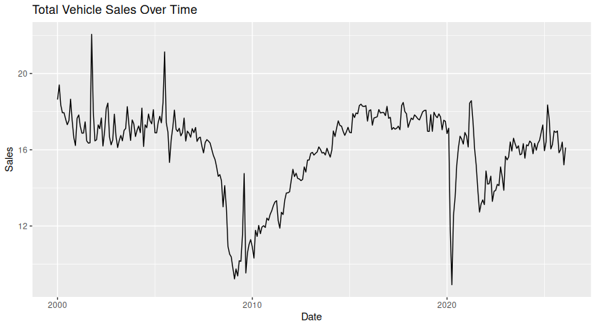
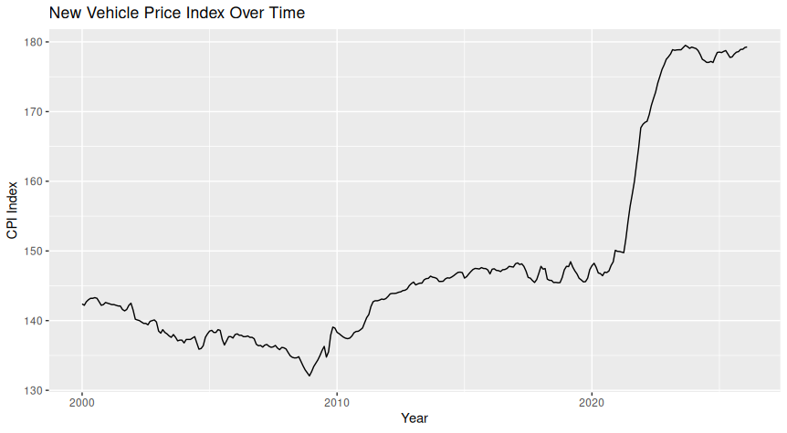
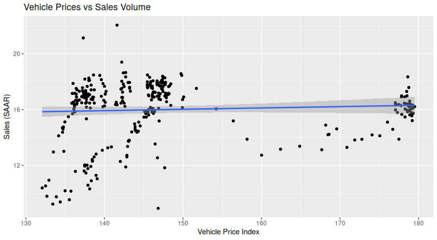
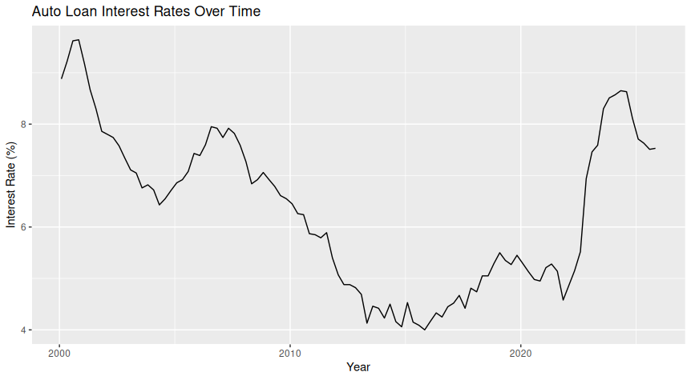
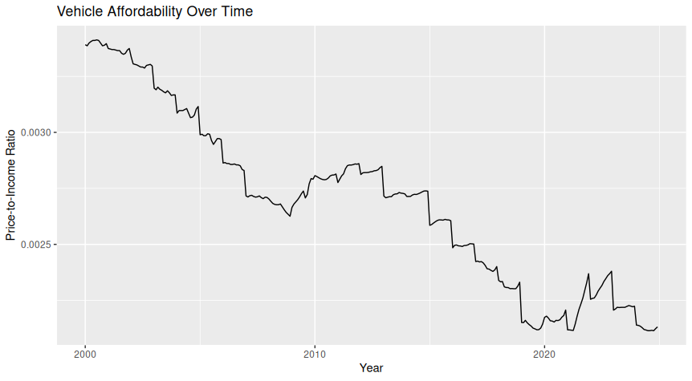

# The-Cost-of-the-Drive
Vehicle Prices, Loan Rates, and U.S. Auto Sales
# 🚗 The Cost of the Drive: Vehicle Prices, Loan Rates, and U.S. Auto Sales

## 📌 Overview

This project analyzes how rising vehicle prices affect consumer demand in the U.S. automotive market.

Over the past decade, vehicle prices have increased significantly due to inflation, supply chain disruptions, and a shift toward higher-priced SUVs and electric vehicles.

This analysis evaluates whether higher prices and rising financing costs are associated with declining vehicle sales and reduced affordability.

---

## ❓ Business Question

**How have rising vehicle prices and auto loan interest rates impacted U.S. vehicle sales and affordability over time?**

---

## 👥 Stakeholders

* Automotive manufacturers
* Auto dealerships
* Financial institutions providing auto loans
* Market analysts
* Consumers

---

## 📊 Data Sources

* Federal Reserve Economic Data (FRED)
* Bureau of Economic Analysis (BEA)
* U.S. Census Bureau

---

## 🛠 Tools & Technologies

* SQL (BigQuery)
* R
* ggplot2
* tidyverse

---

## 🔄 Analysis Process

1. Collected vehicle pricing, sales, interest rate, and income data
2. Built a structured data model in BigQuery (fact and dimension tables)
3. Cleaned and merged datasets using SQL
4. Created a unified analytical dataset (`vw_auto_market_analysis`)
5. Imported data into R for analysis
6. Performed trend analysis and correlation analysis
7. Built visualizations to communicate insights

---

## 📈 Key Insights

* Vehicle prices increased significantly over the last decade.
* Rising auto loan interest rates increased the cost of financing vehicles.
* Vehicle sales volumes declined during periods of higher prices and borrowing costs.
* Affordability worsened as vehicle prices grew faster than household income.
* The relationship between price increases and sales suggests a negative demand response.

---

## 📊 Visualizations

### 1. Vehicle Sales Trend



### 2. Vehicle Price Trend



### 3. Price vs Sales Relationship



### 4. Auto Loan Interest Rates



### 5. Vehicle Affordability



---

## 🗂 Project Structure

```
auto-market-analysis/
│
├── data/                # Raw datasets (FRED downloads)
├── sql/
│   ├── create_tables.sql
│   ├── build_fact_tables.sql
│   ├── final_view.sql
│
├── r/
│   ├── auto_market_analysis.R
│
├── outputs/             # Saved visualizations
│   ├── vehicle_sales_trend.png
│   ├── vehicle_price_trend.png
│   ├── price_vs_sales.png
│   ├── auto_loan_rates.png
│   ├── vehicle_affordability.png
│
└── README.md
```

---

## 🚀 How to Reproduce This Project

1. Download datasets from FRED, BEA, and Census
2. Load data into BigQuery
3. Create fact tables using SQL scripts
4. Build the final analytical view (`vw_auto_market_analysis`)
5. Connect R to BigQuery using `bigrquery`
6. Run the R script to generate visualizations

---

## 💡 Future Improvements

* Incorporate used vehicle price data
* Add regional (state-level) analysis
* Build a Power BI dashboard for interactive reporting
* Include predictive modeling (forecasting sales trends)

---

## 📎 Summary

This project demonstrates a full analytics workflow:

**Data Engineering (SQL) → Data Analysis (R) → Data Visualization (ggplot2) → Business Insights**

It highlights how rising prices and financing costs impact consumer demand in the U.S. auto market.

---
